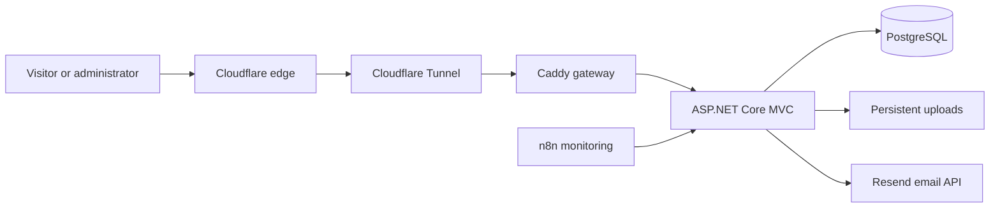

<div align="center">
  
  <h1>Emecworks Portfolio</h1>
  <p>An engineering and cybersecurity portfolio for documenting projects, research, homelab systems, and technical work.</p>
  <p>
    <a href="https://emecworks.com">Live site</a>
    &middot;
    <a href="https://knowledge.emecworks.com">Knowledge base</a>
    &middot;
    <a href="https://emecworks.com/hire">Contact</a>
  </p>
</div>

## Overview

Emecworks is the platform I use to publish and organize work across cybersecurity, reverse engineering, electronics, homelab infrastructure, and software development. It is not a static portfolio template: content, media, network diagrams, messages, and operational data are managed by a private administration area backed by PostgreSQL.

The public interface is intentionally lightweight and content-focused. Longer build notes and technical documentation are published separately through the read-only [Emecworks Knowledge Base](https://knowledge.emecworks.com).

## Main features

- Dedicated collections for security research, electronics, homelab projects, web applications, articles, notes, and team records.
- Markdown content editing with sanitized public rendering.
- Media uploads, project galleries, and full-size image viewing.
- Interactive homelab topology maps with administrator-controlled layout and public locking.
- Site-wide search, RSS feeds, `sitemap.xml`, canonical metadata, and structured SEO data.
- A trackable work-request channel with ticket numbers, email delivery, administrative replies, and abuse controls.
- Privacy-oriented, daily-unique traffic statistics rather than third-party behavioral analytics.
- A private administration area for content, messages, categories, services, settings, and account security.
- Public legal, privacy, cookie, and security disclosure pages.

## Technology

| Area | Technology |
| --- | --- |
| Application | ASP.NET Core MVC 8, C# |
| Data | PostgreSQL, Entity Framework Core, ASP.NET Core Identity |
| Interface | Razor views, Tailwind CSS, locally bundled fonts and browser assets |
| Content | Markdig, EasyMDE |
| Topology | vis-network |
| Containers | Docker Compose |
| Edge | Caddy, Cloudflare Tunnel |
| Email and abuse protection | Resend, Cloudflare Turnstile |
| Operations | n8n, health checks, scheduled monitoring and backups |

## Architecture



The application and database are not published directly to the Internet in production. Traffic enters through the Cloudflare tunnel and the Caddy gateway. Persistent uploads, database data, and ASP.NET data-protection keys are stored outside the disposable application container.

Related self-hosted services use separate Compose projects and restricted Docker networks. They are documented under [`deploy/`](deploy/) and are not required for basic local portfolio development.

## Security approach

This repository applies several layers of defense rather than relying on a single perimeter control:

- ASP.NET Core Identity and a non-default administration route.
- Anti-forgery validation, input validation, output encoding, and sanitized Markdown rendering.
- Content Security Policy and additional browser security headers.
- Forwarded-header validation for operation behind the trusted reverse proxy.
- Rate limits and Cloudflare Turnstile on abuse-sensitive public actions.
- Restricted upload handling and persistent data-protection keys.
- Container health checks, dropped privileges where supported, and network separation.
- Redacted operational reporting and privacy-preserving visitor identifiers.
- Automated database and application-data backups with a documented recovery process.

Security-related reports can be submitted using the contact information in [`security.txt`](wwwroot/.well-known/security.txt) or through the [request channel](https://emecworks.com/hire).

## Run locally with Docker

### Requirements

- Git
- Docker Desktop or Docker Engine with Compose

### Setup

```powershell
git clone https://github.com/emecyildiz/Portfolio.git
cd Portfolio
Copy-Item .env.example .env
```

Replace every placeholder in `.env` before starting the application. Use unique development-only values and never commit the resulting file.

```powershell
docker compose up --build
```

The local services are then available at:

- Portfolio: `http://localhost:8080`
- PostgreSQL: `127.0.0.1:5432`

Uploaded files and database data are retained in Docker volumes. Stop the stack without deleting those volumes using:

```powershell
docker compose down
```

## Build without Docker

The application can also be built with the .NET 8 SDK and Node.js:

```powershell
npm ci
npm run assets:build
dotnet restore
dotnet build
```

A PostgreSQL instance and a valid development connection string are still required to run the application. Entity Framework migrations are applied during application startup.

## Configuration

The tracked [`.env.example`](.env.example) file documents the local configuration surface. Important groups include:

| Group | Purpose |
| --- | --- |
| `POSTGRES_*` | Local database name and credentials |
| `ADMIN_*` | Initial administrator account and private route |
| `ANALYTICS_HASH_KEY` | Pseudonymous daily visitor counting |
| `PRIVACY_*` | Public operator and hosting disclosure |
| `TICKET_EMAIL_*` | Optional request-confirmation and reply email delivery |
| `TURNSTILE_*` | Optional public-form bot protection |

Production secrets are stored outside the repository. Do not add API keys, passwords, database dumps, recovery archives, uploaded private material, or real environment files to Git.

## Repository structure

```text
Areas/Admin/        Private administration area
Assets/             Tailwind source and client-asset build scripts
Controllers/        Public MVC endpoints
Data/               EF Core database context and data configuration
Middleware/         Request and security middleware
Migrations/         Portfolio database migrations
Models/             Domain and view models
Services/           Content, email, analytics, security, and support services
Views/              Razor views for the public site and shared layout
deploy/             VPS, proxy, monitoring, CTI, backup, and recovery material
wwwroot/             Public static assets and persistent upload mount point
```

## Operational documentation

Deployment material is intentionally split by responsibility:

- [`deploy/CTI.md`](deploy/CTI.md) - private CTI collection and reporting services.
- [`deploy/MONITORING.md`](deploy/MONITORING.md) - health and log monitoring.
- [`deploy/RECOVERY.md`](deploy/RECOVERY.md) - encrypted off-site recovery bundles and restore order.
- [`deploy/TICKET_EMAIL.md`](deploy/TICKET_EMAIL.md) - request email delivery.
- [`deploy/TURNSTILE.md`](deploy/TURNSTILE.md) - public form protection.
- [`deploy/PRIVACY.md`](deploy/PRIVACY.md) - production privacy disclosure configuration.

These documents describe the current Emecworks environment. Review and adapt them before using any part of the deployment design elsewhere.

## Project status

Emecworks is actively maintained as my personal portfolio and engineering workspace. Content and supporting services continue to evolve as projects are completed and documented.

## License

No open-source license is currently granted for this repository. The source is public for portfolio review and technical reference.
